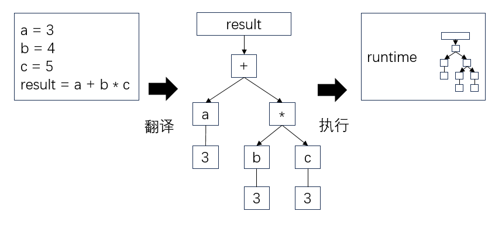

# 编程语言
> **阅前须知**：本文档**不针对任何特定语言**，主要描述对象为接近 oop 的语言（类似 Js、Python、Java、C#、Cpp 等）。  
> 如果你指望在这里学到某门语言的具体用法，那就大错特错了。  
> 关于**某门特定编程语言**的速成，推荐到**菜鸟教程**去查看。这里是小学教材，不能替代幼教过程。  

一门编程语言都不会的小朋友一定要去至少了解一门再来也不迟：  
[菜鸟教程 runoob.com](https://www.runoob.com/)

本文档有一个不切实际的希望：看完之后，每当你面对一门新语言，你都应当能猜出大多语言的设计——没错，举一反三的要诀是**猜**而不是**查**或**背**，100 个问题中，有 90 个都得猜出来，否则会累死人。  

国内编程语言的课大多又臭又长，翻来覆去就讲语法。好一些的会带上编译过程、执行过程的解释——但都太冗长。  
要想做到**不被语言拖累**，三天上手新语言的水平，我们需要在学语言之前了解编程语言的大概结构：  

- code 文本代码
- parser 语法分析器
- runtime 运行时环境

在文本框中输入代码，parser 负责将**文本代码**翻译为语法树 AST，最后运行时环境（runtime、进程）负责执行 AST。  
  
> 所以，当我们说编译器报错、运行时报错，你至少得知道是**哪个环节**出了问题。  

我们重点关心语法语义层面 **（代码层）** ，只会少量碰到 parser 和 runtime。  
